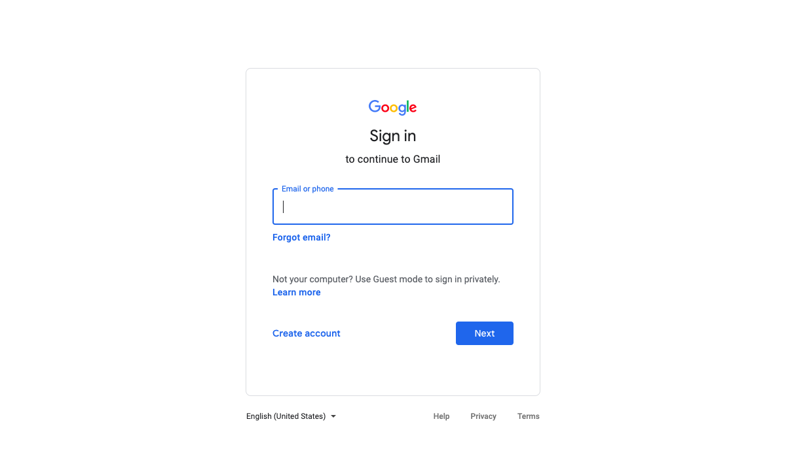
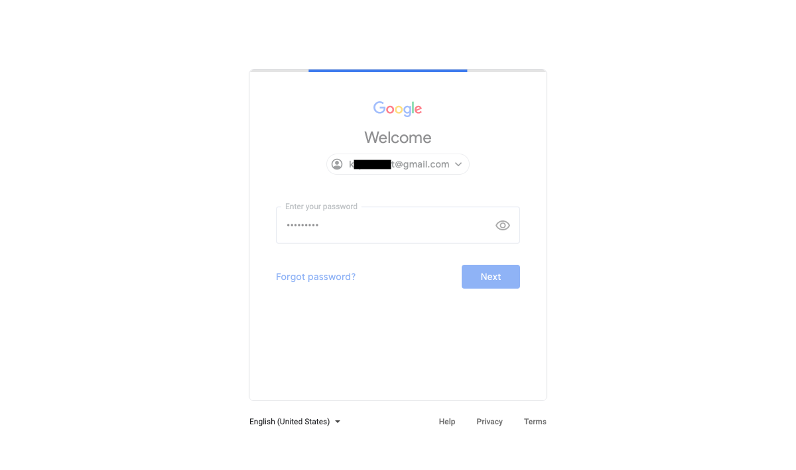
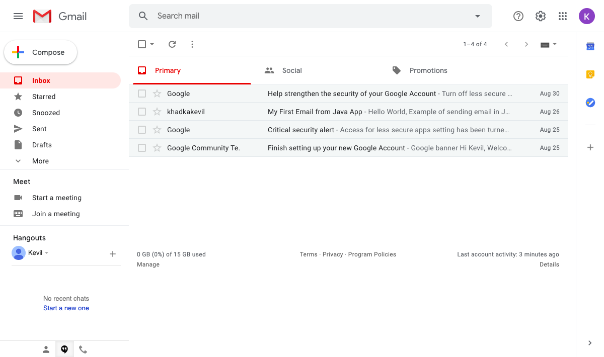
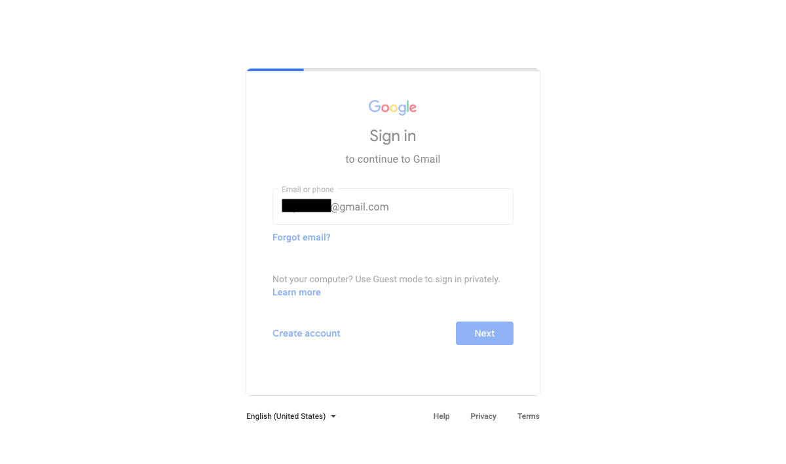
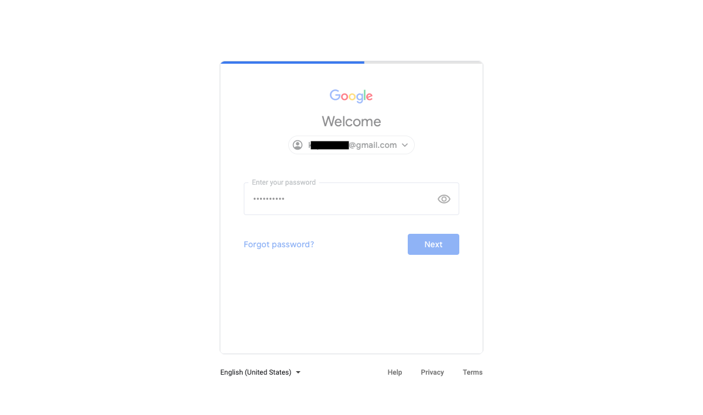
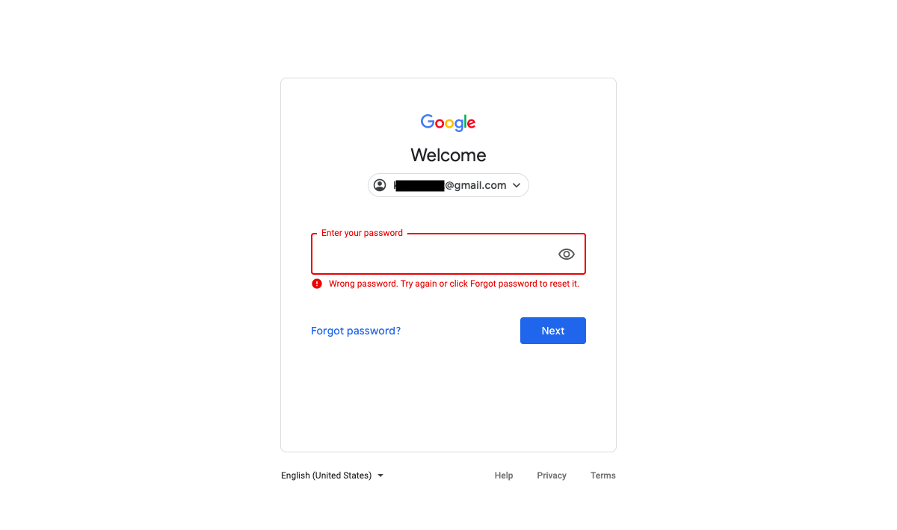

<h2>Automate Screenshots of the whole Gmail Login Process Using Selenium WebDriver</h2>

This program take an automatic screenshot of the whole Gmail login process, from gmail.com to the main email page. And also we provide a wrong gmail password in our second test where it capture a screenshot of a false Gmail password login.


Lets start by following step:

Platform supporting Maven: [IntelliJ IDEA CE](https://www.jetbrains.com/idea/download/download-thanks.html?platform=mac&code=IIC)

1. Create a new Project

2. Choose [Maven](https://en.wikipedia.org/wiki/Apache_Maven#:~:text=Maven%20is%20a%20build%20automation,%2C%20Scala%2C%20and%20other%20languages.&text=Maven%20is%20built%20using%20a,application%20controllable%20through%20standard%20input.)

3. In Project SDK box, make sure you have latest version of java "JDK"

<p align="center">
	
</p>

4. Click Next, and give a name to your project, like "verifyDataProj"

5. Now create a package inside src/test/java/ and name it "verifyDataPack" then create a class inside it, name it "screenshotHandle".


<h4> What is Maven? </h4>

"Maven is a build automation tool used primarily for Java projects. Maven can also be used to build and manage projects written in C#, Ruby, Scala, and other languages.

Maven addresses two aspects of building software: how software is built, and its dependencies. An XML file describes the software project being built, its dependencies on other external modules and components, the build order, directories, and required plug-ins. It comes with pre-defined targets for performing certain well-defined tasks such as compilation of code and its packaging. 

Maven dynamically downloads Java libraries and Maven plug-ins from one or more repositories such as the Maven 2 Central Repository, and stores them in a local cache. Maven projects are configured using a Project Object Model, which is stored in a [pom.xml](https://github.com/kk289/Java-ScreenShot-Handle-Test-using-Selenium/blob/master/pom.xml) file."

An example of [pom.xml](https://github.com/kk289/Java-ScreenShot-Handle-Test-using-Selenium/blob/master/pom.xml) file looks like: 

```
<?xml version="1.0" encoding="UTF-8"?>
<project xmlns="http://maven.apache.org/POM/4.0.0"
         xmlns:xsi="http://www.w3.org/2001/XMLSchema-instance"
         xsi:schemaLocation="http://maven.apache.org/POM/4.0.0 http://maven.apache.org/xsd/maven-4.0.0.xsd">
    <modelVersion>4.0.0</modelVersion>

    <groupId>org.example</groupId>
    <artifactId>OpenBrowser</artifactId>
    <version>1.0-SNAPSHOT</version>
    <build>
        <plugins>
            <plugin>
                <groupId>org.apache.maven.plugins</groupId>
                <artifactId>maven-compiler-plugin</artifactId>
                <configuration>
                    <source>8</source>
                    <target>8</target>
                </configuration>
            </plugin>
        </plugins>
    </build>

    <properties>
        <project.build.sourceEncoding>UTF-8</project.build.sourceEncoding>
        <maven.compiler.source>1.7</maven.compiler.source>
        <maven.compiler.target>1.7</maven.compiler.target>
    </properties>

    <dependencies>

    	<dependency>
      		<groupId>junit</groupId>
      		<artifactId>junit</artifactId>
      		<version>4.11</version>
      		<scope>test</scope>
    	</dependency>

        <!-- https://mvnrepository.com/artifact/org.seleniumhq.selenium/selenium-java-->
    	<dependency>
      		<groupId>org.seleniumhq.selenium</groupId>
      		<artifactId>selenium-java</artifactId>
      		<version>3.141.59</version>
      		<scope>test</scope>
    	</dependency>

    	<!-- https://mvnrepository.com/artifact/org.seleniumhq.selenium/selenium-api -->
    	<dependency>
      		<groupId>org.seleniumhq.selenium</groupId>
      		<artifactId>selenium-api</artifactId>
     		<version>3.141.59</version>
      		<scope>test</scope>
    	</dependency>

    	<dependency>
      		<groupId>io.github.bonigarcia</groupId>
      		<artifactId>webdrivermanager</artifactId>
      		<version>3.8.1</version>
    	</dependency>

    	<dependency>
      		<groupId>org.testng</groupId>
      		<artifactId>testng</artifactId>
      		<version>6.14.2</version>
      		<scope>test</scope>
    	</dependency>

    	<dependency>
      		<groupId>javax.activation</groupId>
      		<artifactId>activation</artifactId>
      		<version>1.1</version>
     	 	<scope>test</scope>
    	</dependency>

    </dependencies>

</project>
```

9. Make sure to setup your "pom.xml" file like above. Just replace your pom.xml file with this [pom.xml](https://github.com/kk289/Java-ScreenShot-Handle-Test-using-Selenium/blob/master/pom.xml)

10. Let's look at "screenshotHandle" class:

## screenshotHandle

```
package verifyDataPack;

import org.apache.commons.io.FileUtils;
import org.junit.After;
import org.junit.Before;
import org.junit.Test;
import org.openqa.selenium.*;
import org.openqa.selenium.chrome.ChromeDriver;
import java.io.File;
import java.io.IOException;

public class screenshotHandle {

    static WebDriver driver;

    // Open ChromeBrowser
    @Before
    public void browser() throws IOException, InterruptedException {
        System.setProperty("webdriver.chrome.driver", "/usr/local/bin/chromedriver"); // chrome browser
        driver = new ChromeDriver();
        driver.get("http://www.gmail.com");
        takeScreenshot("_1MainPage");  		 // Screenshot 1
        Thread.sleep(3000);
    }

        @Test
        // Test 1: Successful Gmail Login
        public void login() throws Exception {
            // email
            WebElement useremail = driver.findElement(By.id("identifierId"));
            useremail.sendKeys("example@gmail.com", Keys.ENTER);   // Enter gmail address
            takeScreenshot("_2emailPage");		// Screenshot 2
            Thread.sleep(5000);

            // password
            WebElement password = driver.findElement(By.name("password"));
            password.sendKeys("*******", Keys.ENTER);  // Enter gmail password
            takeScreenshot("_3passwordPage");		   // Screenshot 3
            Thread.sleep(5000);
            takeScreenshot("_4GmailPage");			   // Screenshot 4
        }

    @Test
    // Test 2: Unsuccessful Gmail Login since password is wrong
    public void captureScreenshotPasswordInvalid() throws Exception {
        // email
        WebElement useremail = driver.findElement(By.id("identifierId"));
        useremail.sendKeys("example@gmail.com", Keys.ENTER);   // Enter gmail address
        takeScreenshot("_5emailPageNextTest");				   // Screenshot 5
        Thread.sleep(5000);

        // password
        WebElement password = driver.findElement(By.name("password"));
        password.sendKeys("*******", Keys.ENTER);    // Enter wrong gmail password
        takeScreenshot("_6wrongPasswordEnter");		 // Screenshot 6
        Thread.sleep(5000);
        takeScreenshot("_7wrongPasswordMessage");	 // Screenshot 7
    }

        public static void takeScreenshot (String fileName) throws IOException {
            // 1. take Screenshot and store it as a file Format:
            File file = ((TakesScreenshot) driver).getScreenshotAs(OutputType.FILE);

            // 2. now copy the screenshot to desired location using copyFile method:
            FileUtils.copyFile(file, new File("/Users/kevilkhadka/IdeaProjects/AutomationJava/src/test/screenShot/" + fileName + ".png"));     // Choose path to save all screenshots
        }

    @After
    // Close the browser
    public void Close() throws InterruptedException {
        Thread.sleep(4000);
        driver.quit();
    }
}
```

There are two tests in this program. First test run successfully since we provide correct gmail account and password. In second test, we provide wrong gmail password which way main gmail page wont open. Both test runs automatically as we run the code, so we just need to sit back and watch it. Also all screenshots are saved in given directory, like I put this path -> "/Users/kevilkhadka/IdeaProjects/AutomationJava/src/test/screenShot/". We can easily replace the path wherever we want to save all screenshots. And I am using png extension for all screenshots, just change the extension whichever you want, like ".jpg". Also Make sure to enter gmail address and password wherever it ask you to enter on the main program file.

Let's run the "screenshotHandle" class. The program run automatically, and once it is done, check the folder where you have saved your screenshots. All of my screenshots are provided below, in order:

<p align="center">
	
	<br>
	<br>
	
	<br>
	<br>
	
	<br>
	<br>
	
	<br>
	<br>
	
	<br>
	<br>
	
	<br>
	<br>
	
</p>

<br>

<b>Thank you. Let me know if you have any questions.</b>
